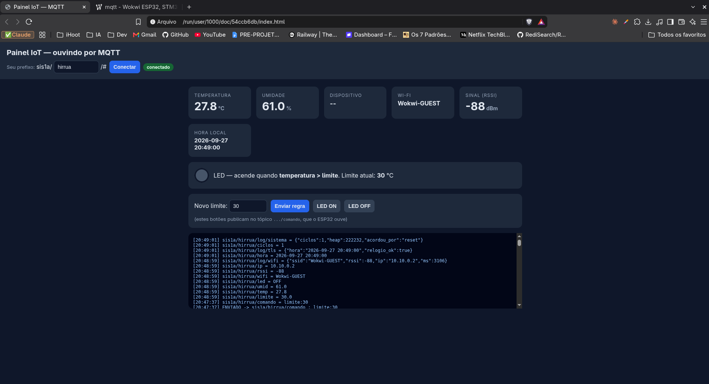

# ENTREGA — MQTT com Mosquitto

**Prefixo:** `sis1a/hirrua/` · **Simulação:** Wokwi (ESP32 + DHT22 + LED no GPIO 2)

Link do projeto no Wokwi: _(colar aqui)_

## Tópicos publicados

| Tópico | Exemplo | Quando |
|---|---|---|
| `temp` | `27.8` | alterado no wokwi |
| `umid` | `61.0` | alterado no wokwi |
| `led` | `ON` / `OFF` | quando muda (e no 1º boot) |
| `limite` | `25.0` | quando chega comando `limite:` |
| `wifi` / `rssi` / `ip` | `Wokwi-GUEST` / `-55` / `10.13.37.2` | todo ciclo |
| `log/wifi` | `{"ssid":"Wokwi-GUEST","rssi":-55,"ip":"10.13.37.2","ms":820}` | todo ciclo |
| `hora` / `log/tls` | `2026-09-27 18:03:11` / `{"hora":"...","relogio_ok":true}` | todo ciclo |
| `ciclos` / `log/sistema` | `4` / `{"ciclos":4,"heap":231000,"acordou_por":"timer"}` | todo ciclo |
| `comando` (assinado) | `limite:25`, `led:ON`, `led:OFF`, `led:AUTO` | vem do serviço |

Todas as mensagens são publicadas **retidas**, então o painel já abre com o último valor. O serviço também publica o comando retido, para o ESP32 recebê-lo mesmo que esteja dormindo na hora do envio.

## Prints

1. Serial do Wokwi (ciclo completo: Wi-Fi → MQTT → PUBs → janela → dormindo):
   
   
2. Serviço Python lendo os tópicos separados:
   
3. MQTT Explorer com a árvore `sis1a/hirrua/`:
   
4. Painel HTML:
    
    

## Respostas

**1. Pub/sub e o papel do broker.**
Publicar é enviar uma mensagem para um tópico e assinar é registrar interesse num tópico para receber o que for publicado nele. Publisher e subscriber não se conhecem: os dois só falam com o broker que recebe cada mensagem e a entrega a todos os assinantes daquele tópico.

**2. Por que vários tópicos em vez de um só.**
Cada interessado assina só o que precisa. Um painel de temperatura assina `sis1a/hirrua/temp` e não recebe nem precisa interpretar um JSON.

**3. O que os logs dizem sobre a saúde do dispositivo.**
O log de Wi-Fi mostra em qual rede ele está, a força do sinal. O tempo alto ou RSSI baixo sugerem que o sensor está longe do roteador e gastando mais bateria. O log de TLS mostra se o relógio foi sincronizado por NTP. O log de sistema acrescenta ciclos, heap livre (queda contínua indica vazamento de memória) e o motivo do despertar (um `reset` inesperado indica travamento ou queda de energia).

**4. Por que o relógio importa para o TLS.**
Para validar o certificado do servidor, o dispositivo compara a data atual com o período de validade do certificado. Se o relógio estiver errado o certificado parece fora da validade e o handshake TLS falha.

**5. O que muda no código com Deep Sleep.**
Ao acordar do deep sleep o ESP32 reinicia do zero e executa o `setup()` de novo, então todo o trabalho (conectar, ler, publicar, ouvir, dormir) fica no `setup()` e o `loop()` fica vazio. Variáveis comuns são perdidas no sono; as marcadas com `RTC_DATA_ATTR` ficam na memória RTC, que continua alimentada. Usei isso para o contador `ciclos`, o `limite`, o modo do LED e o último estado publicado do LED.

**6. Trade-off entre Deep Sleep e comandos em tempo real.**
Dormindo, fica desligado e o consumo cai porém o ESP32 só recebe comandos durante a janela em que está acordado (5 s a cada ~30 s). Um comando pode esperar até um ciclo inteiro para ser aplicado. Para amenizar, o serviço publica o comando retido: o broker guarda a última mensagem e a entrega assim que o ESP32 acorda e assina o tópico.

**7. Caminho de um comando até o LED acender.**
Digito `on` no serviço → o Python faz `publish("sis1a/hirrua/comando", "led:ON", retain=True)` → o broker guarda e entrega aos assinantes → o ESP32 acorda, conecta e assina `comando` → dentro da janela, o `mqtt.loop()` chama `aoReceber()` → o código define `modoLed = 1` → `aplicarLed()` faz `digitalWrite(LED, HIGH)` → o LED acende e o ESP32 publica `ON` em `sis1a/hirrua/led`, que o serviço exibe.